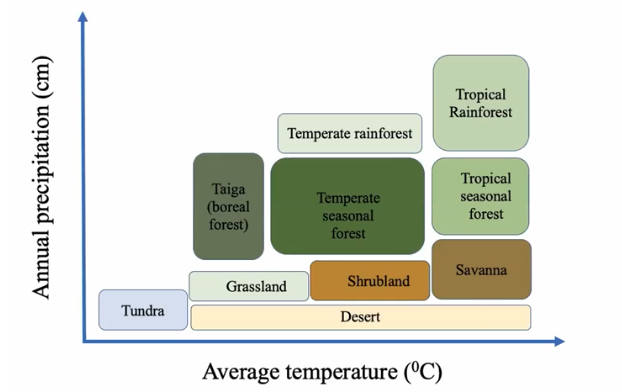
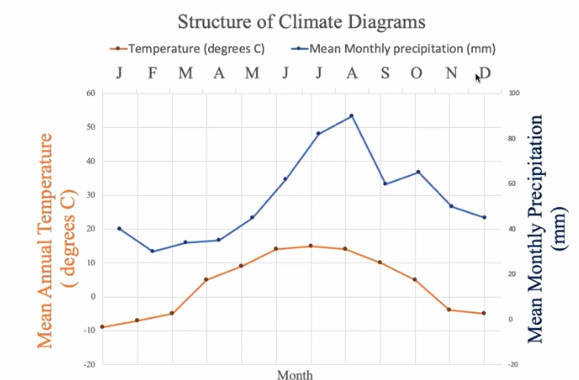
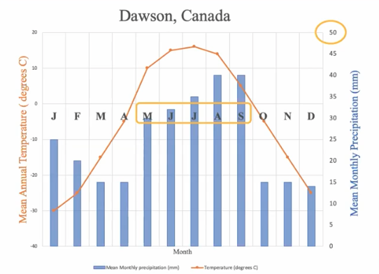

# 1.2 Terrestrial Biomes

Type: Ecosystems

Organism → population → community → ecosystem → **biome**

[[biomes]] are characterized by **temperature**, **precipitation**, and **latitude**.

Hot humid regions have greater primary productivity and greater biodiversity than cold and dry regions

Biomes characterized by precipitation and temperature

**Altitude** also affects what biome is present

Example of how you can find multiple biomes in one state – all dependent on altitude

**Climatograms**: show precipitation and temperature of a location. They have two Y axes (scales)

- Identify growing season – where the temperature is over 0ºC
- If the line is flat, the temperature and precipitation is constant throughout the year
- They often have different scales – pay attention to the scale
- If temperature is over precipitation, it might be a desert

Another representation of graph with bars

Environmental science also looks at humans interactions with ecosystems (different than ecology)

**[[Human impact]]**:

- Broadleaf temperate rainforest – logging and habitation
- Shrubland – habitation and favorable climate
- Temperate grasslands – agriculture
- Taiga – logging, tar sands, natural gas
- Tropical Rainforests – remain mostly intact. Timber, palm oil, grazing is there in some though.

Biomes change in location over time: Some animals will die out, other will migrate, and others adapt.