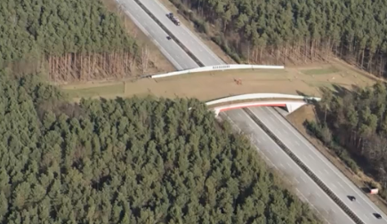

# 2.3 Island Biogeography

Type: Biodiversity

Theory of ocean island biogeography:

- **highest** species richness found in **large** islands **near** the mainland
- **lowest** species richness found in **small** islands **far** from mainland

When islands are created, there is more edge habitat and less core habitat. 

Species that can better adapt and live in edge habitat are selected when habitats are fragmented.

Clear cutting is a common cause of habitat fragmentation.

Apex predators prefer a connected habitat versus a fragmented habitat.

A highway or a road is another cause of habitat fragmentation.

Habitat corridors: They reduce the effects of habitat fragmentation through connecting the islands

Connecting two islands through this corridor over the highway

**Species evenness** : Calculated by the Simpson and the Shannon index