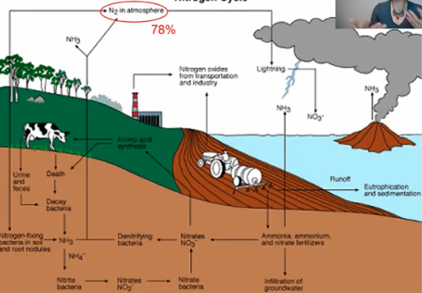

# 1.5 The Nitrogen Cycle

Type: Ecosystems

**Nitrogen Cycle**: Movement of atoms/molecules containing the element nitrogen in sources and sinks

This is a **\[\[biogeochemical cycle\]\]**

Extremely important

* limiting factor in ecosystems
* major component of amino acids
* Producers need nitrogen to grow

1. **Fixation**: Nitrogen fixed by lightning \(abiotic\) or microbes \(biotic\) into soil or root nodules
2. **Ammonification** Fixed nitrogen NH3 is converted into NH4 by bacteria. It can also be added by decaying organic material
3. **Nitrification**: NH4 is converted to NO2 and then to NO3
4. **Assimilation**: NO3 uptaken by plants through their roots. Animals get it by eating plants
5. **Denitrification**: NO3 converted back to N2 by soil bacteria

Nitrogen cycle is primarily **driven by microbial actions**

Atmosphere is a main reservoir of nitrogen

Most **nitrogen reservoirs are short term**.

