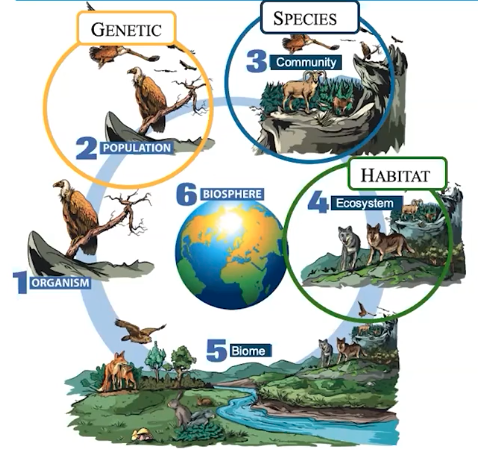

# 2.1 Introduction to Biodiversity

Type: Biodiversity

**Genetic diversity**: DNA, not visible from outside usually

**Species diversity**: Count number of species \(Visible\)

**Habitat diversity**: How the habitat changes \(salinity, tide\)

How do we compare biodiversity?

* Number of species present \(**Species** **richness**\)
* Relative abundance of species \(**species evenness**\)

High primary productivity = high biodiversity

Nature selects for certain favorable traits, and against other unfavorable traits \(**natural selection**\).

If the gene pool decreases, you go through a population bottleneck. Population bottlenecks can cause inbreeding.

Examples of selective pressures:

* Predators \(bright color leads to increased predation\) – biotic factor
* Water temperature, salinity – abiotic factors

* Greater **genetic** diversity = better response to environmental stressors
* Loss of **habitat** harms specialists first, and then the generalists.
* Ecosystems with more **species** better recover from disturbance

Specialists have a harder time adapting to disturbance compared to generalists.

**Higher biodiversity**:

* Some variation in the environment
* Evolution
* Minor disturbances \(surface fires\)
* High habitat diversity

**Lower biodiversity:**

* continuous environmental stress
* extinction
* extreme disturbances \(hurricanes, crown fires, clear cutting\)
* geographic isolation
* invasive species

